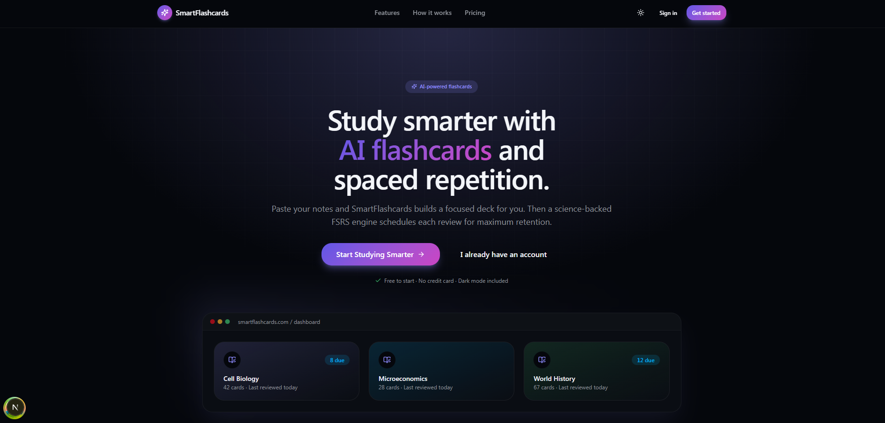
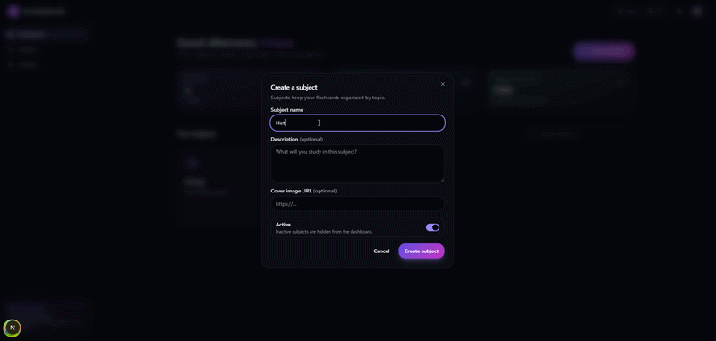
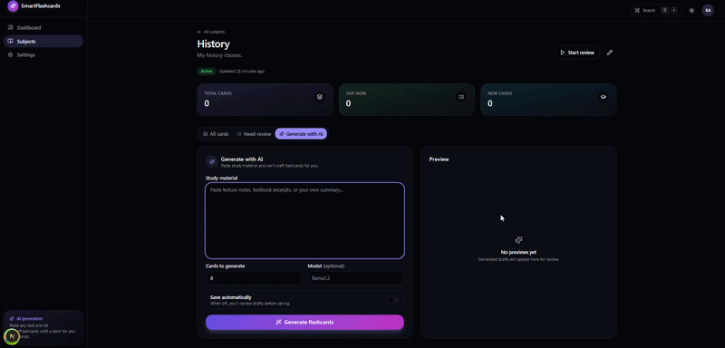
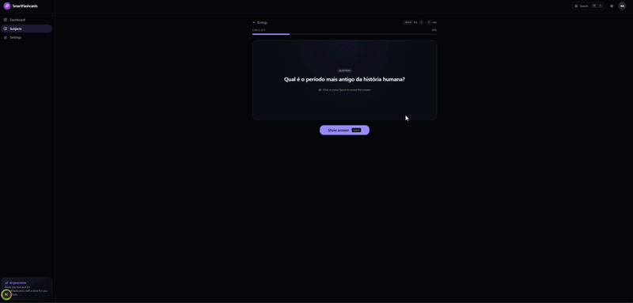

# SmartFlashcards

**AI-powered flashcards with FSRS spaced repetition.**  
Create subjects, generate flashcards from study material, and review at the right time with a polished, modern SaaS interface.

**Flashcards inteligentes com IA e repetição espaçada FSRS.**  
Crie matérias, gere flashcards a partir de materiais de estudo e revise no momento ideal com uma interface moderna, rápida e elegante.



---

## English

### Overview

SmartFlashcards is a full-stack study platform built to turn raw study material into high-quality flashcards and schedule reviews using FSRS. The product focuses on speed, simplicity, and a distraction-free study experience inspired by modern SaaS tools.

The backend exposes a cookie-based API with authentication, subjects, flashcards, AI generation, and review scheduling. The frontend is a production-ready Next.js app with dark mode, responsive layouts, skeleton states, optimistic updates, keyboard shortcuts, and smooth animations.

### Demo

#### Create subjects

Organize flashcards by topic, course, or exam.



#### Generate flashcards with AI

Paste study material, choose how many cards to generate, preview drafts, and save the cards you want.



#### Review with FSRS

Review one card at a time with flip animations, progress tracking, and rating controls: Again, Hard, Good, and Easy.



### Key Features

- Account registration, login, logout, and authenticated sessions with HttpOnly JWT cookies.
- Subject management with create, edit, delete, search, and empty states.
- Manual flashcard creation and editing.
- AI flashcard generation from long-form study material.
- Preview generated cards before saving.
- FSRS-based review flow with due-card filtering.
- Keyboard shortcuts for fast review sessions.
- Dark mode, command palette, responsive UI, skeleton loaders, toasts, dialogs, and polished animations.

### Tech Stack

#### Frontend

- Next.js 15 App Router
- TypeScript
- TailwindCSS
- shadcn-style UI primitives
- TanStack Query
- Zustand
- Zod
- React Hook Form
- Axios
- Framer Motion

#### Backend

- Node.js
- Express
- TypeScript
- Prisma
- PostgreSQL
- JWT in HttpOnly cookies
- FSRS scheduling
- Ollama-powered flashcard generation

### Project Structure

```text
studyhub.com/
  client/   Next.js frontend
  server/   Express + Prisma backend
  assets/   README screenshots and GIFs
```

### Running Locally

#### Backend

```bash
cd server
npm install
npm run prisma:generate
npm run dev
```

The backend runs on `http://localhost:3000` by default.

#### Frontend

```bash
cd client
npm install
cp .env.example .env
npm run dev
```

The frontend runs on `http://localhost:3001`.

### Environment Variables

Frontend:

```env
NEXT_PUBLIC_API_URL=http://localhost:3000
NEXT_PUBLIC_AUTH_COOKIE_NAME=access_token
NEXT_PUBLIC_SITE_NAME=SmartFlashcards
```

Backend:

```env
DATABASE_URL=postgresql://...
JWT_SECRET=your-secret
WEB_ORIGIN=http://localhost:3001
```

For production, prefer a same-site deployment or a frontend proxy to the backend so HttpOnly cookies work reliably.

---

## Português

### Visão Geral

SmartFlashcards é uma plataforma full-stack de estudos criada para transformar materiais brutos em flashcards de qualidade e agendar revisões usando FSRS. O produto prioriza velocidade, simplicidade e uma experiência de estudo sem distrações, inspirada em ferramentas SaaS modernas.

O backend oferece uma API com autenticação via cookies HttpOnly, matérias, flashcards, geração por IA e agendamento de revisões. O frontend é uma aplicação Next.js pronta para produção, com modo escuro, layout responsivo, skeleton loaders, atualizações otimistas, atalhos de teclado e animações suaves.

### Demonstração

#### Criação de matérias

Organize seus flashcards por assunto, curso ou prova.


#### Geração de flashcards com IA

Cole um material de estudo, escolha quantos cartões gerar, visualize os rascunhos e salve os flashcards desejados.


#### Revisão com FSRS

Revise um cartão por vez com animação de flip, indicador de progresso e botões de avaliação: Again, Hard, Good e Easy.


### Principais Funcionalidades

- Cadastro, login, logout e sessão autenticada com JWT em cookie HttpOnly.
- Gerenciamento de matérias com criação, edição, exclusão, busca e estados vazios.
- Criação e edição manual de flashcards.
- Geração de flashcards por IA a partir de materiais de estudo.
- Pré-visualização dos cards gerados antes de salvar.
- Fluxo de revisão baseado em FSRS com filtro de cards pendentes.
- Atalhos de teclado para revisões rápidas.
- Modo escuro, command palette, interface responsiva, skeleton loaders, toasts, diálogos e animações polidas.

### Stack Técnica

#### Frontend

- Next.js 15 App Router
- TypeScript
- TailwindCSS
- Componentes no estilo shadcn/ui
- TanStack Query
- Zustand
- Zod
- React Hook Form
- Axios
- Framer Motion

#### Backend

- Node.js
- Express
- TypeScript
- Prisma
- PostgreSQL
- JWT em cookies HttpOnly
- Agendamento FSRS
- Geração de flashcards com Ollama

### Estrutura do Projeto

```text
studyhub.com/
  client/   Frontend em Next.js
  server/   Backend Express + Prisma
  assets/   Imagens e GIFs usados no README
```

### Como Rodar Localmente

#### Backend

```bash
cd server
npm install
npm run prisma:generate
npm run dev
```

Por padrão, o backend roda em `http://localhost:3000`.

#### Frontend

```bash
cd client
npm install
cp .env.example .env
npm run dev
```

O frontend roda em `http://localhost:3001`.

### Variáveis de Ambiente

Frontend:

```env
NEXT_PUBLIC_API_URL=http://localhost:3000
NEXT_PUBLIC_AUTH_COOKIE_NAME=access_token
NEXT_PUBLIC_SITE_NAME=SmartFlashcards
```

Backend:

```env
DATABASE_URL=postgresql://...
JWT_SECRET=your-secret
WEB_ORIGIN=http://localhost:3001
```

Em produção, prefira hospedar frontend e backend no mesmo site ou usar um proxy do frontend para o backend, garantindo que os cookies HttpOnly funcionem corretamente.
