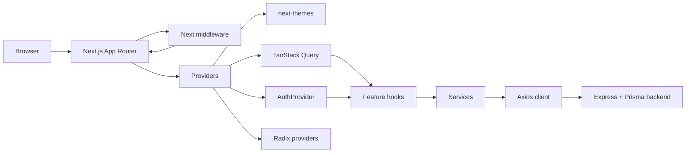
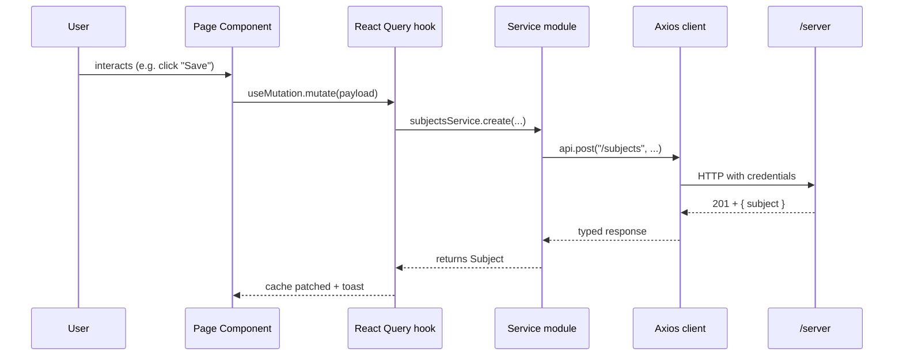
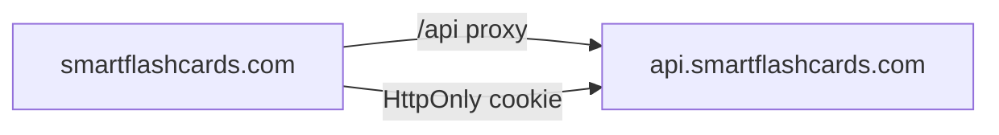

# SmartFlashcards — Web Client

Production-ready Next.js 15 frontend for **SmartFlashcards**, an AI-powered
flashcards platform with FSRS spaced repetition. The app pairs with the
Express + Prisma backend in [`../server`](../server).

> Built with the Next.js App Router, TailwindCSS v4, shadcn-style primitives,
> TanStack Query, Zustand, Zod, React Hook Form, Axios and Framer Motion.

---

## Highlights

- **App Router**, route groups for `(marketing)`, `(auth)` and `(app)`.
- **Auth** with HttpOnly JWT cookie (`credentials: include`), `AuthProvider`
  bound to `/auth/me`, automatic redirect on `401`, and a Next middleware that
  protects `/dashboard`, `/subjects`, `/settings`.
- **Type-safe API layer** (Axios + service modules + DTO-aligned types).
- **TanStack Query** for server state, with optimistic delete and cache patches
  for create / update mutations.
- **Premium AI generation panel** with progress feedback, draft preview,
  per-card save, and one-click "save all".
- **Polished review session** — flip animation, keyboard shortcuts (`Space`,
  `1`–`4`), progress bar, session summary.
- **Design system** — neutral OKLCH palette, dark mode via `next-themes`,
  rounded-2xl cards, gradients, skeletons, empty states, sonner toasts.
- **Bonus** — Cmd/Ctrl-K command palette, theme toggle, smooth list/page
  transitions with Framer Motion, accessible focus rings.

---

## Architecture



### Folder structure

```
src/
  app/                        # App Router routes (with route groups)
    (marketing)/page.tsx      # Landing page
    (auth)/login, register    # Auth pages
    (app)/dashboard           # Protected app shell
    (app)/subjects/[id]       # Subject details + tabs
    (app)/subjects/[id]/review
    (app)/settings
    layout.tsx, error.tsx, not-found.tsx, loading.tsx, globals.css
  components/
    ui/                       # shadcn-style primitives
    layout/                   # Navbar, footer, sidebar, app shell, topbar
    common/                   # Page container, empty state, stats card,
                              # confirm dialog, theme toggle, command palette
  features/
    auth/                     # Login/register forms, schemas, ProtectedRoute
    subjects/                 # Subject card / form / dialogs
    flashcards/               # Flashcard list, AI panel, review card
  hooks/                      # use-subjects, use-flashcards, use-keyboard
  lib/                        # api client, error normalization, utils, env
  providers/                  # Theme, Query, Auth, root <Providers>
  services/                   # auth, subjects, flashcards, users
  store/                      # Zustand UI store (sidebar, command palette)
  types/                      # API types and shared enums
middleware.ts                 # Cookie-based route protection
```

### Data flow



---

## Running locally

### 1. Start the backend

The frontend talks to the Express API in [`../server`](../server).

```bash
cd ../server
npm install
npm run prisma:generate
# create .env from .env.example, set DATABASE_URL and JWT_SECRET, then:
npm run dev   # http://localhost:3000
```

The backend now ships with credentialed CORS support driven by `WEB_ORIGIN`
(comma-separated list, defaults to `http://localhost:3001`). Override it in
`server/.env` when deploying.

### 2. Start the frontend

```bash
cd client
cp .env.example .env.local       # adjust if your backend isn't on :3000
npm install
npm run dev                      # http://localhost:3001
```

### Available scripts

| Command           | Purpose                                |
| ----------------- | -------------------------------------- |
| `npm run dev`     | Next.js dev server on port `3001`      |
| `npm run build`   | Production build                       |
| `npm run start`   | Run the production build on port `3001`|
| `npm run lint`    | ESLint via Next.js                     |
| `npm run typecheck` | `tsc --noEmit`                       |

---

## Environment variables

Copy `.env.example` to `.env.local` and adjust as needed.

| Variable                       | Description                                                                                    |
| ------------------------------ | ---------------------------------------------------------------------------------------------- |
| `NEXT_PUBLIC_API_URL`          | Public URL of the backend. Must be reachable from the browser. Default `http://localhost:3000` |
| `NEXT_PUBLIC_AUTH_COOKIE_NAME` | Cookie name set by the backend. Default `access_token`. Must match `AUTH_COOKIE_NAME` server-side |
| `NEXT_PUBLIC_SITE_NAME`        | App name used in metadata and chrome. Default `SmartFlashcards`                                 |

`NEXT_PUBLIC_*` prefixes are required because these are read in the browser.

The backend exposes one extra variable used during deployment:

| Variable     | Description                                                                                  |
| ------------ | -------------------------------------------------------------------------------------------- |
| `WEB_ORIGIN` | Allowed origins for CORS (`http://localhost:3001` in dev). Comma-separated for multiple URLs. |

---

## Deployment

The frontend is a standard Next.js 15 app and deploys cleanly to Vercel,
Netlify, Fly, Railway, Render, or a Docker host.

### Recommended setup



- Prefer **same-site** hosting (e.g. proxy `/api/*` from the frontend host to
  the backend) so `SameSite=Lax` cookies work without third-party cookie
  restrictions.
- If frontend and backend live on different origins, set
  `WEB_ORIGIN=https://app.example.com` and serve both over HTTPS so cookies
  set with `Secure` are accepted.

### Vercel

1. Import the `client/` folder as a Vercel project.
2. Set the env vars: `NEXT_PUBLIC_API_URL`, optional cookie/site name vars.
3. Add a rewrite to your backend if you want same-origin auth:
   ```json
   {
     "rewrites": [
       { "source": "/api/:path*", "destination": "https://api.example.com/:path*" }
     ]
   }
   ```
   Then set `NEXT_PUBLIC_API_URL=https://app.example.com/api`.
4. Deploy.

### Docker (alternative)

```dockerfile
FROM node:20-alpine AS deps
WORKDIR /app
COPY package*.json ./
RUN npm ci

FROM deps AS build
COPY . .
RUN npm run build

FROM node:20-alpine AS runner
WORKDIR /app
ENV NODE_ENV=production
COPY --from=build /app/.next ./.next
COPY --from=build /app/public ./public
COPY --from=build /app/package*.json ./
COPY --from=build /app/next.config.ts ./
RUN npm ci --omit=dev
EXPOSE 3001
CMD ["npm", "run", "start"]
```

---

## Backend integration notes

- Auth is HttpOnly cookie. The Axios client sends `withCredentials: true` and
  the Next middleware checks the `access_token` cookie before allowing
  `/dashboard`, `/subjects`, or `/settings`.
- All endpoints return `{ subject }`, `{ subjects }`, `{ flashcard }`,
  `{ flashcards }`, `{ user }` shapes. Services unwrap them and expose the
  inner DTOs to React.
- Review ratings: `again`, `hard`, `good`, `easy` (case insensitive on the
  server, the UI sends lowercase).
- AI generation: `POST /subjects/:id/flashcards/generate` returns
  `{ flashcards, persisted }`. When `persist: false`, the UI shows drafts and
  saves them with subsequent `POST /subjects/:id/flashcards` calls.

---

## Quality checklist

- ✅ `npm run typecheck` — no TypeScript errors
- ✅ `npm run build` — production build succeeds, all routes generated
- ✅ `npm run lint` — no ESLint warnings
- ✅ Dark mode + system theme
- ✅ Responsive (mobile-first, tested through Tailwind breakpoints)
- ✅ Accessible focus rings, ARIA labels, keyboard support for the review
  session and command palette
