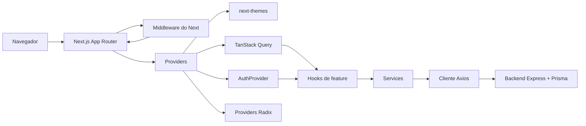
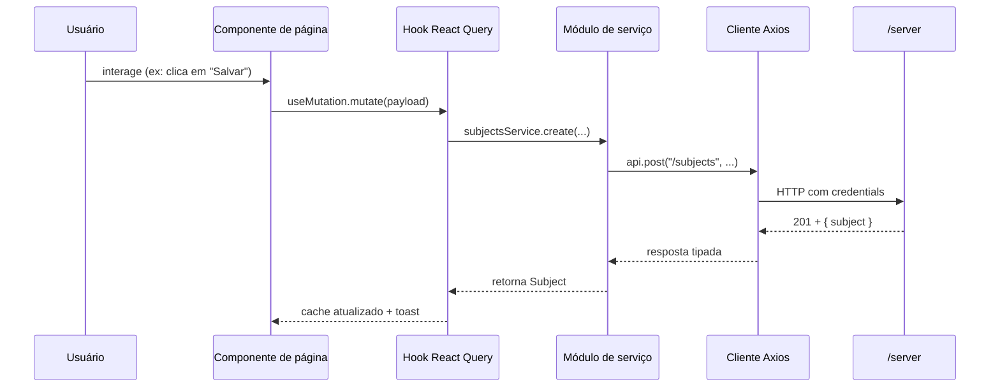
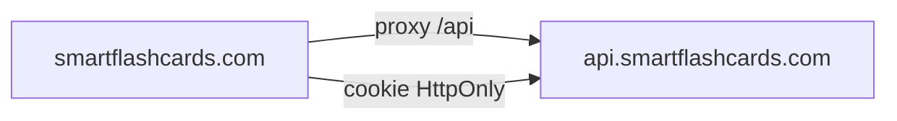

# SmartFlashcards — Cliente Web

Frontend Next.js 15 pronto para produção para o **SmartFlashcards**, uma
plataforma de flashcards com IA e repetição espaçada FSRS. A aplicação integra
com o backend Express + Prisma em [`../server`](../server).

> Construído com Next.js App Router, TailwindCSS v4, primitivas no estilo
> shadcn/ui, TanStack Query, Zustand, Zod, React Hook Form, Axios e Framer
> Motion.

---

## Destaques

- **App Router**, com grupos de rotas para `(marketing)`, `(auth)` e `(app)`.
- **Autenticação** com cookie JWT HttpOnly (`credentials: include`),
  `AuthProvider` ligado ao `/auth/me`, redirecionamento automático em `401` e
  middleware do Next protegendo `/dashboard`, `/subjects` e `/settings`.
- **Camada de API tipada** (Axios + módulos de serviço + tipos alinhados aos
  DTOs do backend).
- **TanStack Query** para estado de servidor, com exclusão otimista e patches
  de cache para mutações de criação e atualização.
- **Painel premium de geração por IA** com feedback de progresso,
  pré-visualização de rascunhos, salvamento individual por card e ação de
  "salvar tudo".
- **Sessão de revisão polida** — animação de flip, atalhos de teclado
  (`Espaço`, `1`–`4`), barra de progresso e resumo da sessão.
- **Design system** — paleta neutra em OKLCH, modo escuro via `next-themes`,
  cards arredondados, gradientes, skeletons, estados vazios e toasts com
  Sonner.
- **Extras** — command palette com Cmd/Ctrl-K, alternância de tema,
  transições suaves de listas/páginas com Framer Motion e focus rings
  acessíveis.

---

## Arquitetura



### Estrutura de pastas

```text
src/
  app/                        # Rotas do App Router (com grupos de rota)
    (marketing)/page.tsx      # Landing page
    (auth)/login, register    # Páginas de autenticação
    (app)/dashboard           # Shell protegido da aplicação
    (app)/subjects/[id]       # Detalhes da matéria + abas
    (app)/subjects/[id]/review
    (app)/settings
    layout.tsx, error.tsx, not-found.tsx, loading.tsx, globals.css
  components/
    ui/                       # Primitivas no estilo shadcn/ui
    layout/                   # Navbar, footer, sidebar, app shell, topbar
    common/                   # Page container, empty state, stats card,
                              # confirm dialog, theme toggle, command palette
  features/
    auth/                     # Forms de login/register, schemas, ProtectedRoute
    subjects/                 # Subject card / form / dialogs
    flashcards/               # Lista de flashcards, painel IA, card de revisão
  hooks/                      # use-subjects, use-flashcards, use-keyboard
  lib/                        # cliente api, normalização de erros, utils, env
  providers/                  # Theme, Query, Auth, <Providers> raiz
  services/                   # auth, subjects, flashcards, users
  store/                      # Zustand UI store (sidebar, command palette)
  types/                      # Tipos da API e enums compartilhados
middleware.ts                 # Proteção de rotas baseada em cookie
```

### Fluxo de dados



---

## Rodando localmente

### 1. Inicie o backend

O frontend se comunica com a API Express em [`../server`](../server).

```bash
cd ../server
npm install
npm run prisma:generate
# crie o .env a partir de .env.example, configure DATABASE_URL e JWT_SECRET, depois:
npm run dev   # http://localhost:3000
```

O backend inclui suporte a CORS com credentials controlado por `WEB_ORIGIN`
(lista separada por vírgulas, padrão `http://localhost:3001`). Altere em
`server/.env` no deploy.

### 2. Inicie o frontend

```bash
cd client
cp .env.example .env.local       # ajuste se o backend não estiver em :3000
npm install
npm run dev                      # http://localhost:3001
```

### Scripts disponíveis

| Comando             | Finalidade                                      |
| ------------------- | ----------------------------------------------- |
| `npm run dev`       | Servidor dev do Next.js na porta `3001`         |
| `npm run build`     | Build de produção                              |
| `npm run start`     | Executa o build de produção na porta `3001`     |
| `npm run lint`      | ESLint via Next.js                              |
| `npm run typecheck` | `tsc --noEmit`                                  |

---

## Variáveis de ambiente

Copie `.env.example` para `.env.local` e ajuste conforme necessário.

| Variável                       | Descrição                                                                                                   |
| ------------------------------ | ----------------------------------------------------------------------------------------------------------- |
| `NEXT_PUBLIC_API_URL`          | URL pública do backend. Deve ser acessível pelo navegador. Padrão `http://localhost:3000`                   |
| `NEXT_PUBLIC_AUTH_COOKIE_NAME` | Nome do cookie definido pelo backend. Padrão `access_token`. Deve bater com `AUTH_COOKIE_NAME` no servidor |
| `NEXT_PUBLIC_SITE_NAME`        | Nome da aplicação usado nos metadados e na interface. Padrão `SmartFlashcards`                              |

Os prefixos `NEXT_PUBLIC_*` são obrigatórios porque essas variáveis são lidas
no navegador.

O backend expõe uma variável extra usada no deploy:

| Variável     | Descrição                                                                                          |
| ------------ | -------------------------------------------------------------------------------------------------- |
| `WEB_ORIGIN` | Origens permitidas para CORS (`http://localhost:3001` em dev). Use vírgulas para múltiplas URLs.   |

---

## Deploy

O frontend é uma aplicação Next.js 15 padrão e pode ser publicado em Vercel,
Netlify, Fly, Railway, Render ou em um host Docker.

### Configuração recomendada



- Prefira hospedagem **same-site** (por exemplo, proxy `/api/*` do host do
  frontend para o backend) para que cookies `SameSite=Lax` funcionem sem
  bloqueios de cookies de terceiros.
- Se frontend e backend estiverem em origens diferentes, configure
  `WEB_ORIGIN=https://app.example.com` e sirva ambos via HTTPS para que cookies
  com `Secure` sejam aceitos.

### Vercel

1. Importe a pasta `client/` como projeto na Vercel.
2. Configure as variáveis de ambiente: `NEXT_PUBLIC_API_URL` e, se necessário,
   as variáveis opcionais de cookie/nome do site.
3. Adicione um rewrite para o backend se quiser autenticação same-origin:
   ```json
   {
     "rewrites": [
       { "source": "/api/:path*", "destination": "https://api.example.com/:path*" }
     ]
   }
   ```
   Depois configure `NEXT_PUBLIC_API_URL=https://app.example.com/api`.
4. Faça o deploy.

### Docker (alternativa)

```dockerfile
FROM node:20-alpine AS deps
WORKDIR /app
COPY package*.json ./
RUN npm ci

FROM deps AS build
COPY . .
RUN npm run build

FROM node:20-alpine AS runner
WORKDIR /app
ENV NODE_ENV=production
COPY --from=build /app/.next ./.next
COPY --from=build /app/public ./public
COPY --from=build /app/package*.json ./
COPY --from=build /app/next.config.ts ./
RUN npm ci --omit=dev
EXPOSE 3001
CMD ["npm", "run", "start"]
```

---

## Notas de integração com o backend

- A autenticação usa cookie HttpOnly. O cliente Axios envia
  `withCredentials: true` e o middleware do Next verifica o cookie
  `access_token` antes de liberar `/dashboard`, `/subjects` ou `/settings`.
- Os endpoints retornam formatos como `{ subject }`, `{ subjects }`,
  `{ flashcard }`, `{ flashcards }` e `{ user }`. Os services desembrulham
  essas respostas e expõem os DTOs internos para o React.
- Avaliações de revisão: `again`, `hard`, `good`, `easy` (o servidor aceita
  variações capitalizadas, mas a UI envia tudo em minúsculas).
- Geração por IA: `POST /subjects/:id/flashcards/generate` retorna
  `{ flashcards, persisted }`. Quando `persist: false`, a UI mostra rascunhos
  e salva depois usando `POST /subjects/:id/flashcards`.

---

## Checklist de qualidade

- ✅ `npm run typecheck` — sem erros de TypeScript
- ✅ `npm run build` — build de produção concluído, todas as rotas geradas
- ✅ `npm run lint` — sem avisos de ESLint
- ✅ Modo escuro + tema do sistema
- ✅ Responsivo (mobile-first, testado pelos breakpoints do Tailwind)
- ✅ Focus rings acessíveis, ARIA labels e suporte a teclado na sessão de
  revisão e na command palette
