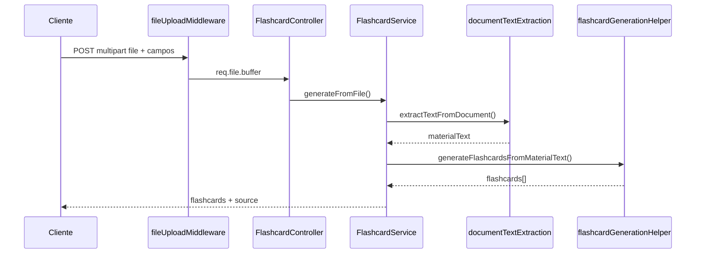

# Flashcards — FSRS e geração por IA

Esta documentação descreve revisão espaçada (FSRS), geração de flashcards por texto e geração a partir de documentos (PDF, DOCX, TXT) no backend.

## Visão geral

O módulo de flashcards cobre:

- **Revisão FSRS** (`ts-fsrs`): listar pendências, aplicar ratings e atualizar agendamento;
- **Geração por IA**: criar cartões a partir de texto colado ou de ficheiros enviados;
- **CRUD** de flashcards dentro de uma matéria (`Subject`), sempre com ownership do utilizador autenticado.

Rotas aninhadas em: `/subjects/:id/flashcards`

---

## Geração por IA

### Endpoints

| Endpoint | Entrada | Armazenamento de ficheiro |
|----------|---------|---------------------------|
| `POST .../flashcards/generate` | JSON com `materialText` | N/A |
| `POST .../flashcards/generate-from-file` | Multipart com campo `file` | **Não** — só o texto extraído é usado |

Os ficheiros são processados **em memória** (`multer.memoryStorage()`). Não existe modelo de domínio para documentos nem persistência em disco/S3.

### Arquitetura (geração a partir de ficheiro)



### Camadas envolvidas

- `middleware/file-upload.middleware.ts` — validação MIME/extensão, limite de tamanho
- `helpers/document-text-extraction.helper.ts` — PDF (`pdf-parse`), DOCX (`mammoth`), TXT
- `helpers/flashcard-generation.helper.ts` — prompt e parsing JSON do LLM (Ollama ou Groq)
- `helpers/ai-agent.helper.ts` — abstração do provider (`LLM_PROVIDER`)
- `flashcard.service.ts` — `generateFromMaterial`, `generateFromFile`
- `flashcard.controller.ts` — handlers HTTP

### Formatos aceites (upload)

| Extensão | MIME |
|----------|------|
| `.pdf` | `application/pdf` |
| `.docx` | `application/vnd.openxmlformats-officedocument.wordprocessingml.document` |
| `.txt` | `text/plain` |

Limites:

- Tamanho do ficheiro: `FILE_UPLOAD_MAX_BYTES` (default **10 MB**)
- Texto extraído: mínimo **50** caracteres; máximo **100 000** (truncagem com `truncated: true` na resposta)
- PDFs só com imagem (sem camada de texto) → `400`

### Gerar a partir de texto (JSON)

`POST /subjects/:id/flashcards/generate`

#### Body

```json
{
  "materialText": "Texto da matéria...",
  "maxCards": 8,
  "model": "llama3.2",
  "persist": false
}
```

| Campo | Tipo | Obrigatório | Descrição |
|-------|------|-------------|-----------|
| `materialText` | string | Sim | 1–100 000 caracteres |
| `maxCards` | number | Não | 1–50 (default 20 no helper) |
| `model` | string | Não | Override do modelo LLM |
| `persist` | boolean | Não | Se `true`, grava na matéria |

#### Resposta (preview)

```json
{
  "flashcards": [{ "front": "...", "back": "..." }],
  "persisted": false
}
```

#### Resposta (persistido)

```json
{
  "flashcards": [/* FlashcardEntity */],
  "persisted": true
}
```

#### Erros

- `502` — falha na geração LLM

### Gerar a partir de ficheiro (multipart)

`POST /subjects/:id/flashcards/generate-from-file`

#### Request

`Content-Type: multipart/form-data`

| Campo | Tipo | Obrigatório | Descrição |
|-------|------|-------------|-----------|
| `file` | File | Sim | PDF, DOCX ou TXT |
| `maxCards` | string/number | Não | 1–50 |
| `model` | string | Não | Modelo LLM |
| `persist` | string/boolean | Não | `"true"` / `true` para gravar |

#### Exemplo (curl)

```bash
curl -X POST "http://localhost:3000/subjects/{subjectId}/flashcards/generate-from-file" \
  -b cookies.txt \
  -F "file=@apostila.pdf" \
  -F "maxCards=8" \
  -F "persist=false"
```

#### Resposta (com metadados do documento)

```json
{
  "flashcards": [{ "front": "...", "back": "..." }],
  "persisted": false,
  "source": {
    "filename": "apostila.pdf",
    "mimeType": "application/pdf",
    "extractedCharCount": 12450,
    "originalCharCount": 150000,
    "truncated": true
  }
}
```

#### Fluxo interno

1. `createDocumentFileUploadMiddleware` + `requireUploadedDocument`
2. Validação dos campos com `generateFromFileFieldsSchema`
3. `extractTextFromDocument(buffer, mimeType)`
4. `generateFromMaterial` com o texto extraído (mesmo pipeline LLM que `/generate`)
5. Resposta enriquecida com `source` (metadados transitórios)

#### Erros específicos

| Status | Causa |
|--------|--------|
| `400` | Ficheiro ausente, tipo inválido, texto insuficiente |
| `413` | Ficheiro acima do limite |
| `502` | Falha na geração LLM |

---

## Revisão FSRS

### Arquitetura

#### Camadas principais

- `flashcard.router.ts` — expõe as rotas HTTP
- `flashcard.controller.ts` — valida entrada HTTP e delega ao service
- `flashcard.service.ts` — orquestra regras de negócio e ownership
- `flashcard.repository.ts` — acesso ao banco via Prisma
- `helpers/fsrs/*` — adapter/wrapper da lib `ts-fsrs`

#### Princípios adotados

- sem lógica de scheduling no controller;
- cálculo de próximo estado delegado ao helper FSRS;
- sem filtro em memória para pendências (`need-review`);
- query eficiente e ordenada por vencimento.

### Modelo de dados (Flashcard)

Campos usados no agendamento:

- `due: DateTime`
- `lastReviewedAt: DateTime?`
- `stability: Float`
- `difficulty: Float`
- `reps: Int`
- `lapses: Int`
- `state: Int`

Índice recomendado:

- `@@index([due])`

### Rotas de revisão

#### 1) Listar cards pendentes

`GET /subjects/:id/flashcards/need-review`

**Regra de seleção:**

- retorna apenas cards com `due <= now`
- ordena por `due ASC` (mais atrasados primeiro)

**Resposta (exemplo):**

```json
{
  "flashcards": [
    {
      "id": "card-id",
      "front": "Pergunta",
      "back": "Resposta",
      "due": "2026-05-06T16:00:00.000Z",
      "stability": 1.2,
      "difficulty": 5.0,
      "reps": 2,
      "lapses": 0,
      "state": 2
    }
  ]
}
```

#### 2) Revisar um card

`POST /subjects/:id/flashcards/:flashcardId/review`

**Body:**

```json
{
  "rating": "good"
}
```

Ratings aceitos: `again`, `hard`, `good`, `easy` (também aceita capitalização, normalizada para minúsculo).

**Fluxo interno:**

1. valida autenticação;
2. valida `flashcardId`;
3. valida body (`rating`);
4. busca card por usuário;
5. monta entrada do helper FSRS com estado atual do card;
6. executa scheduler da lib (`ts-fsrs`);
7. persiste novo estado (`due`, `stability`, `difficulty`, `lastReviewedAt`, `reps`, `lapses`, `state`);
8. retorna card atualizado.

**Resposta (exemplo):**

```json
{
  "flashcard": {
    "id": "card-id",
    "due": "2026-05-10T16:00:00.000Z",
    "lastReviewedAt": "2026-05-06T16:35:00.000Z",
    "stability": 2.34,
    "difficulty": 4.21,
    "reps": 3,
    "lapses": 1,
    "state": 2
  }
}
```

### Helper FSRS

Estrutura:

- `helpers/fsrs/index.ts`
- `helpers/fsrs/fsrs.service.ts`
- `helpers/fsrs/fsrs.types.ts`

Responsabilidades:

- encapsular `ts-fsrs`;
- mapear `rating` da API para enum da lib;
- converter modelo interno para o formato da lib;
- retornar modelo de domínio sem vazar tipos externos.

### Comportamento esperado (ratings)

- `again` reduz/encurta próximo intervalo;
- `hard` aumenta pouco;
- `good` aumenta de forma equilibrada;
- `easy` aumenta mais.

O campo `due` passa a ser a fonte de verdade para fila de revisão (`need-review`).

---

## Erros comuns

| Status | Causa |
|--------|--------|
| `401` | Utilizador sem sessão/token válido |
| `404` | Flashcard ou matéria inexistente / não pertence ao utilizador |
| `400` | Validação falhou (body, rating, ficheiro, texto extraído) |
| `413` | Ficheiro de upload demasiado grande |
| `502` | Falha na geração LLM |

---

## Fluxo de uso recomendado (cliente)

1. **Gerar:** colar texto (`/generate`) ou enviar PDF/DOCX/TXT (`/generate-from-file`) na tab Generate da matéria;
2. Rever drafts (`persist: false`) ou ativar gravação automática;
3. **Revisar:** `need-review` → `review` com rating;
4. Atualizar UI e repetir `need-review` conforme necessário.
